# E-commerce Microservices Project

A complete microservices-based e-commerce application built with Node.js, Express, MongoDB, and RabbitMQ.

## 🏗️ Architecture

This project implements a microservices architecture with the following services:

- **API Gateway** (Port 3003) - Request routing and load balancing
- **Auth Service** (Port 3000) - User authentication and JWT management
- **Product Service** (Port 3001) - Product catalog management
- **Order Service** (Port 3002) - Order processing via message queues

## 🛠️ Tech Stack

- **Backend:** Node.js, Express.js
- **Database:** MongoDB
- **Message Queue:** RabbitMQ
- **Authentication:** JWT (JSON Web Tokens)
- **Password Hashing:** bcryptjs
- **API Testing:** Postman

## 📋 Prerequisites

Before running this project, make sure you have the following installed:

- [Node.js](https://nodejs.org/) (v14 or higher)
- [MongoDB](https://www.mongodb.com/try/download/community) (v4.4 or higher)
- [RabbitMQ](https://www.rabbitmq.com/download.html) (v3.8 or higher)
- [Postman](https://www.postman.com/downloads/) (for API testing)

## 🚀 Quick Start

### 1. Clone the repository

```bash
git clone <repository-url>
cd EProject-Phase-1
```

### 2. Install dependencies for all services

```bash
# Root dependencies
npm install

# Auth service
cd auth && npm install && cd ..

# Product service
cd product && npm install && cd ..

# Order service
cd order && npm install && cd ..

# API Gateway
cd api-gateway && npm install && cd ..
```

````

### 4. Start external services

```bash
# Start MongoDB
mongod

# Start RabbitMQ
rabbitmq-server
````

### 5. Start all microservices

Open 4 separate terminals and run:

```bash
# Terminal 1 - Auth Service
cd auth
node index.js

# Terminal 2 - Product Service
cd product
node index.js

# Terminal 3 - Order Service
cd order
node index.js

# Terminal 4 - API Gateway
cd api-gateway
node index.js
```

## 📚 API Documentation

### Base URL

All requests should be made to: `http://localhost:3003`

### Authentication Endpoints

#### Register User

```http
POST /auth/register
Content-Type: application/json

{
  "username": "testuser1",
  "password": "123456"
}
```

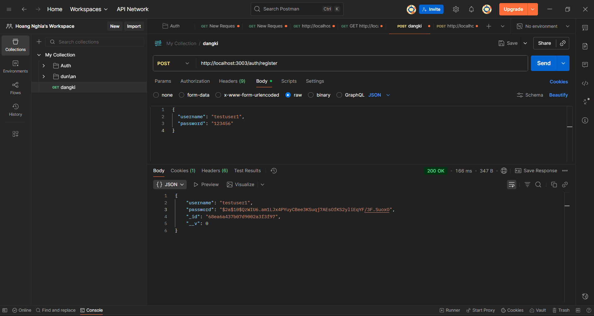

#### Login User

```http
POST /auth/login
Content-Type: application/json

{
  "username": "testuser1",
  "password": "123456"
}
```

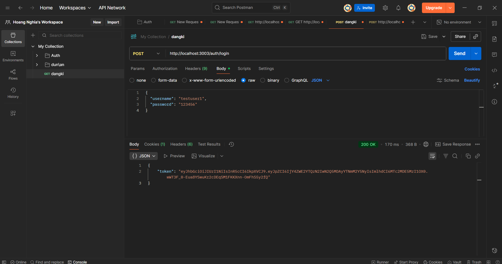

# In MongoDB


#### Access Protected Route

```http
GET /auth/dashboard
Authorization: Bearer <JWT_TOKEN>
```

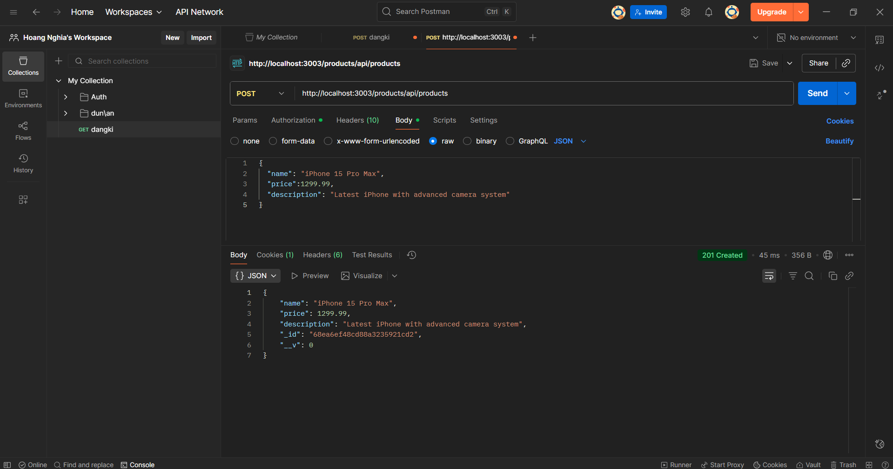

### Product Endpoints

#### Create Product

```http
POST /products/api/products
Authorization: Bearer <JWT_TOKEN>
Content-Type: application/json

{
  "name": "iPhone 15 Pro Max",
  "price":1299.99,
  "description": "Latest iPhone with advanced camera system"
}
```

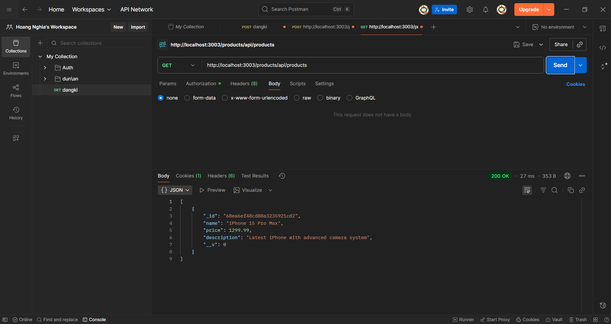

# In MongoDB


#### Get All Products

```http
GET /products/api/products
Authorization: Bearer <JWT_TOKEN>
```

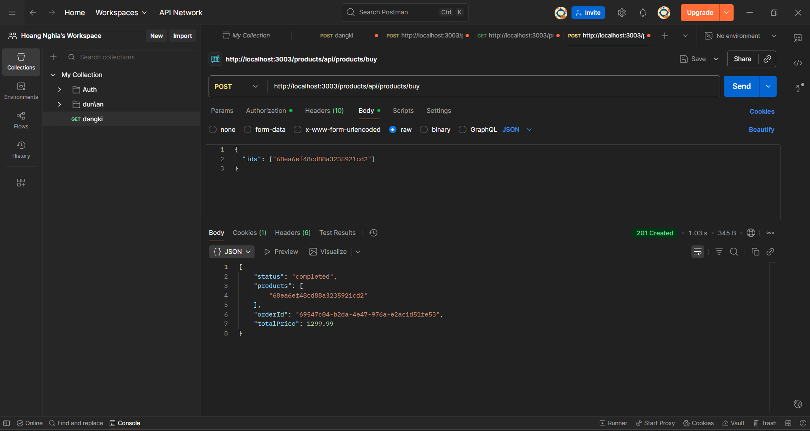

### Order Endpoints

#### Create Order (Buy Products)

```http
POST /products/api/products/buy
Authorization: Bearer <JWT_TOKEN>
Content-Type: application/json

{
  "ids": ["<PRODUCT_ID_1>", "<PRODUCT_ID_2>"]
}
```


## 🧪 Testing

### Test Cases Overview

This section covers comprehensive testing scenarios including both **VALID** ✅ and **INVALID** ❌ test cases.

### Authentication Test Cases

#### ✅ Valid Test Cases

**1. Register New User (Success)**

```http
POST /auth/register
Content-Type: application/json

{
  "username": "testuser1",
  "password": "123456"
}
```

**Expected:** `201 Created` - User registered successfully

**2. Login with Correct Credentials**

```http
POST /auth/login
Content-Type: application/json

{
  "username": "testuser1",
  "password": "123456"
}
```

**Expected:** `200 OK` + JWT token

**3. Access Protected Route with Valid Token**

```http
GET /auth/dashboard
Authorization: Bearer <VALID_JWT_TOKEN>
```

**Expected:** `200 OK` - Dashboard data

#### ❌ Invalid Test Cases

**1. Register with Missing Username**

```http
POST /auth/register
Content-Type: application/json

{
  "password": "123456"
}
```

**Expected:** `400 Bad Request` - Username required

**2. Register with Missing Password**

```http
POST /auth/register
Content-Type: application/json

{
  "username": "testuser2"
}
```

**Expected:** `400 Bad Request` - Password required

**3. Register with Existing Username**

```http
POST /auth/register
Content-Type: application/json

{
  "username": "testuser1",
  "password": "abcdef"
}
```

**Expected:** `400 Bad Request` - User already exists
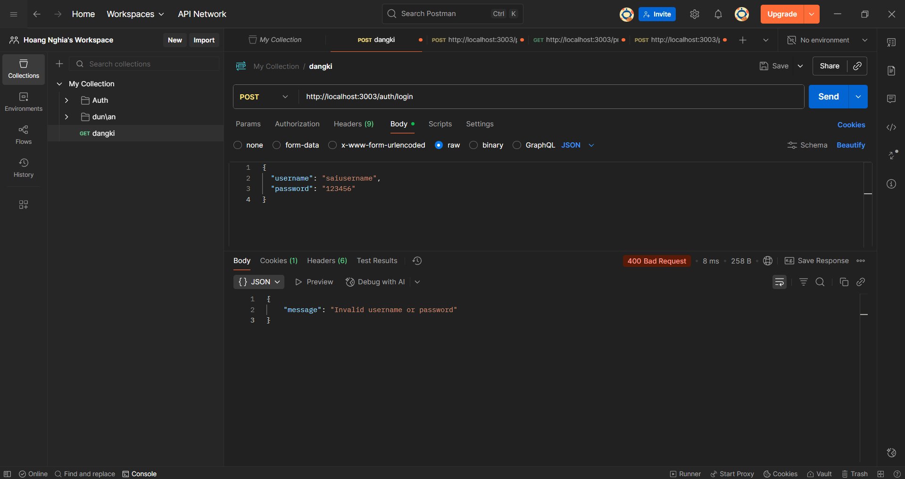
**4. Login with Wrong Username**

```http
POST /auth/login
Content-Type: application/json

{
  "username": "saiusername",
  "password": "123456"
}
```

**Expected:** `401 Unauthorized` - Invalid credentials
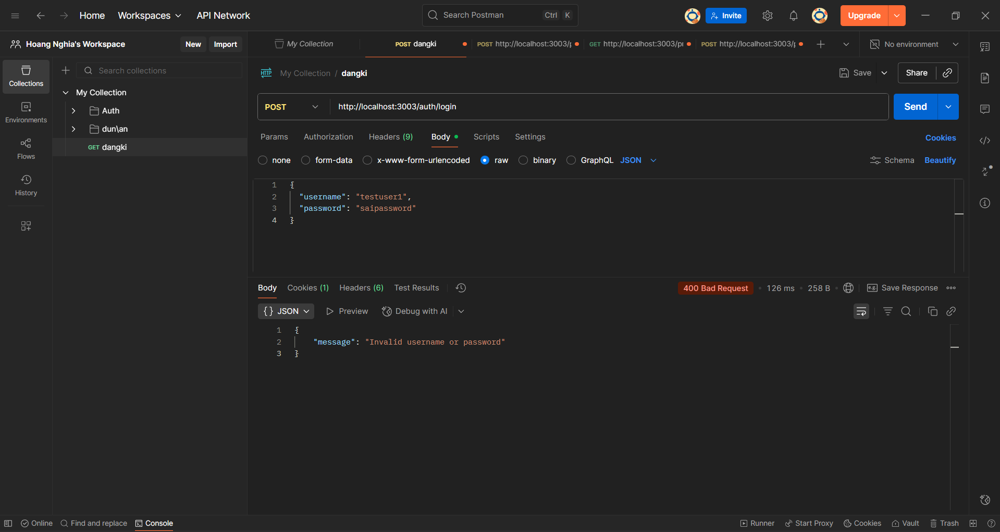
**5. Login with Wrong Password**

```http
POST /auth/login
Content-Type: application/json

{
  "username": "testuser1",
  "password": "saipassword"
}
```

**Expected:** `401 Unauthorized` - Invalid credentials
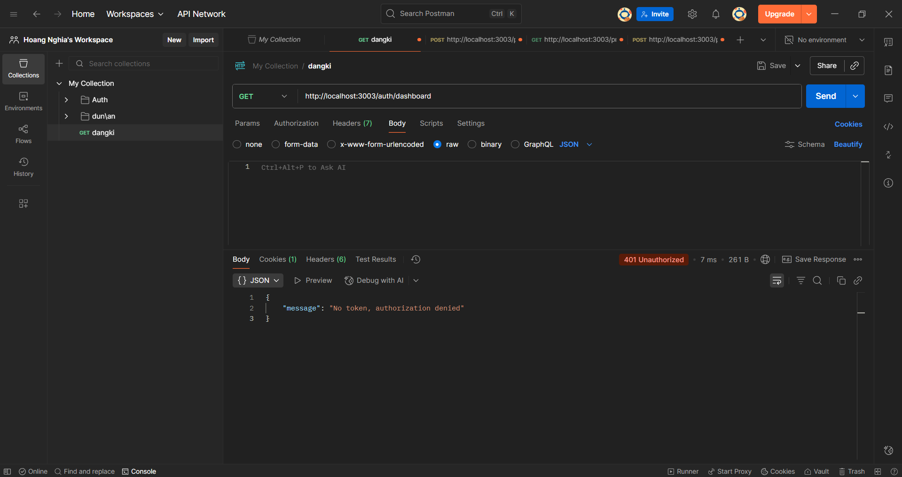
**6. Access Protected Route without Token**

```http
GET /auth/dashboard
```

**Expected:** `401 Unauthorized` - Token required
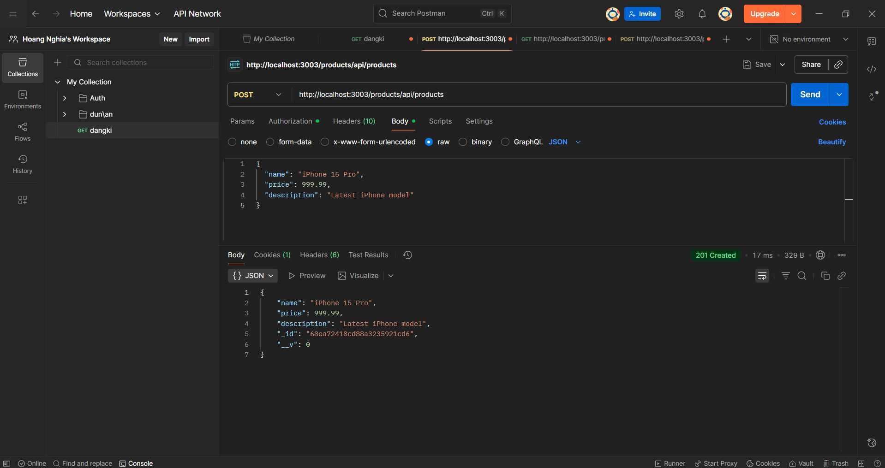
**7. Access Protected Route with Invalid Token**

```http
GET /auth/dashboard
Authorization: Bearer invalid_token_here
```

**Expected:** `403 Forbidden` - Invalid token
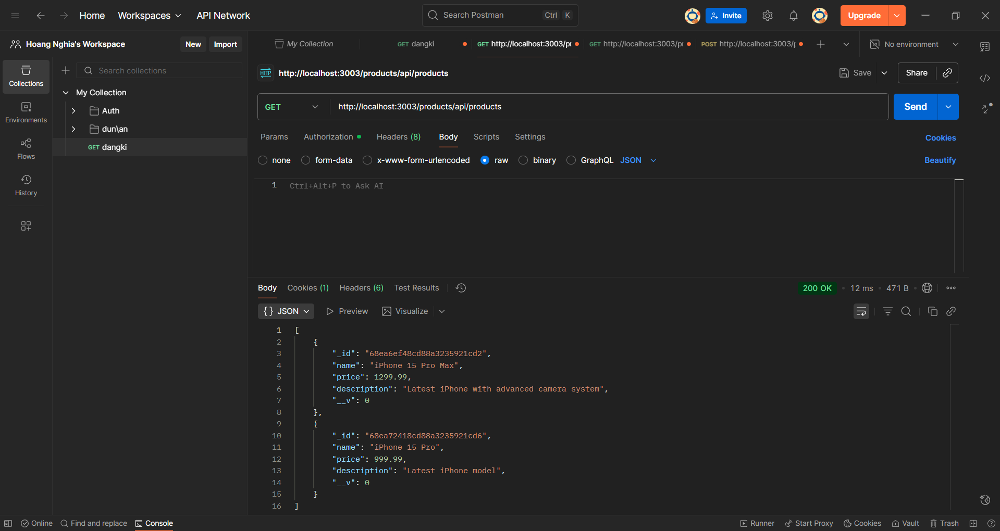

### Product Test Cases

#### ✅ Valid Test Cases

**1. Create Product (Success)**

```http
POST /products/api/products
Authorization: Bearer <VALID_JWT_TOKEN>
Content-Type: application/json

{
  "name": "iPhone 15 Pro",
  "price": 999.99,
  "description": "Latest iPhone model"
}
```

**Expected:** `201 Created` - Product created

**2. Get All Products**

```http
GET /products/api/products
Authorization: Bearer <VALID_JWT_TOKEN>
```

**Expected:** `200 OK` - Array of products

**3. Create Product with Minimum Fields**

```http
POST /products/api/products
Authorization: Bearer <VALID_JWT_TOKEN>
Content-Type: application/json

{
  "name": "Samsung Galaxy",
  "price": 599.99
}
```

**Expected:** `201 Created` - Product created

#### ❌ Invalid Test Cases

**1. Create Product without Authentication**

```http
POST /products/api/products
Content-Type: application/json

{
  "name": "MacBook Pro",
  "price": 2499.99
}
```

**Expected:** `401 Unauthorized` - Token required

**2. Create Product with Missing Name**

```http
POST /products/api/products
Authorization: Bearer <VALID_JWT_TOKEN>
Content-Type: application/json

{
  "price": 999.99,
  "description": "Product without name"
}
```

**Expected:** `400 Bad Request` - Name required
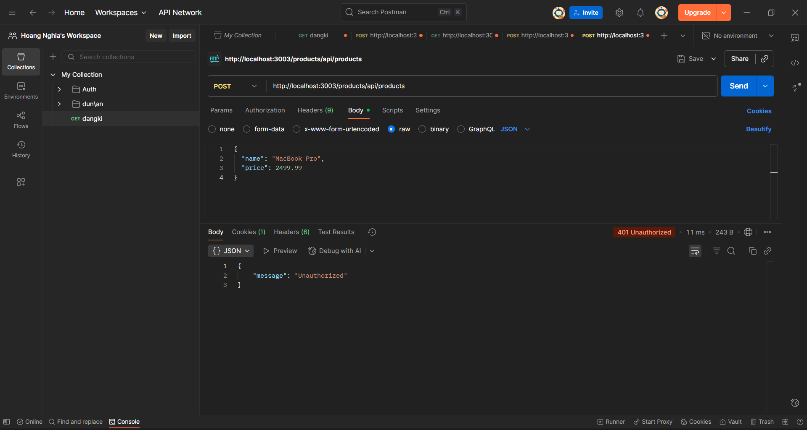
**3. Create Product with Missing Price**

```http
POST /products/api/products
Authorization: Bearer <VALID_JWT_TOKEN>
Content-Type: application/json

{
  "name": "iPad Air",
  "description": "Tablel without price"
}
```

**Expected:** `400 Bad Request` - Price required
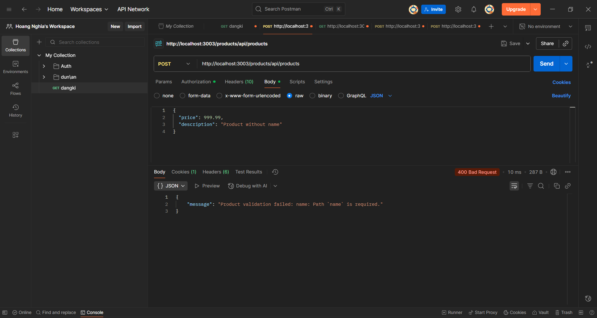

**5. Create Product with Invalid Price Type**

```http
POST /products/api/products
Authorization: Bearer <VALID_JWT_TOKEN>
Content-Type: application/json

{
  "name": "Invalid Price Product",
  "price": "not_a_number",
  "description": "Price should be number"
}
```

**Expected:** `400 Bad Request` - Price must be a number
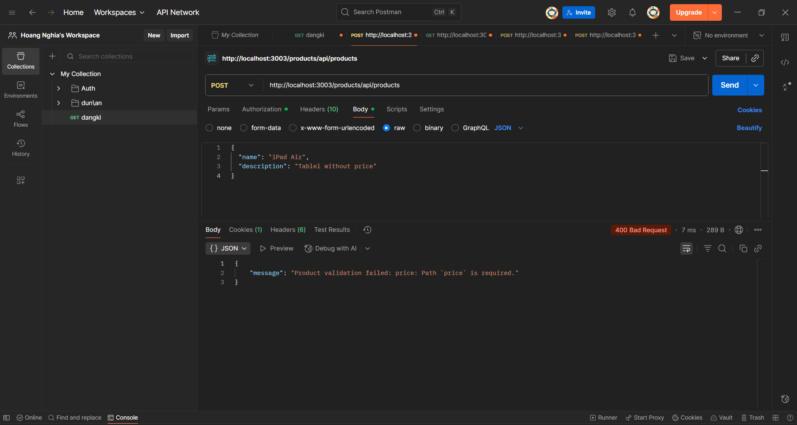
**6. Get Products without Authentication**

```http
GET /products/api/products
```

**Expected:** `401 Unauthorized` - Token required
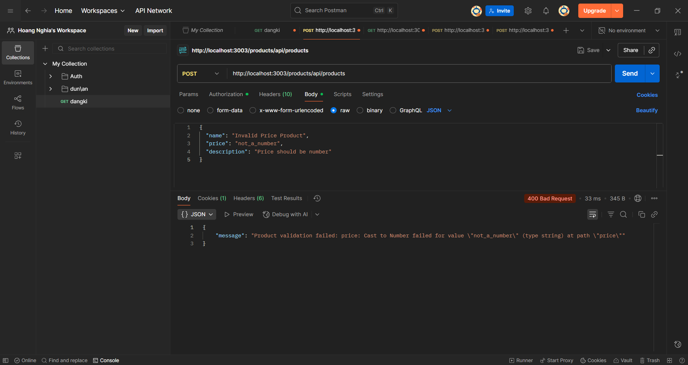

### Order Test Cases

#### ✅ Valid Test Cases

**1. Create Order with Valid Product IDs**

```http
POST /products/api/products/buy
Authorization: Bearer <VALID_JWT_TOKEN>
Content-Type: application/json

{
  "ids": ["64f1a2b3c4d5e6f7g8h9i0j1", "64f1a2b3c4d5e6f7g8h9i0j2"]
}
```

**Expected:** `200 OK` - Order created successfully

**2. Create Order with Single Product**

```http
POST /products/api/products/buy
Authorization: Bearer <VALID_JWT_TOKEN>
Content-Type: application/json

{
  "ids": ["64f1a2b3c4d5e6f7g8h9i0j1"]
}
```

**Expected:** `200 OK` - Order created successfully

#### ❌ Invalid Test Cases

**1. Create Order without Authentication**

```http
POST /products/api/products/buy
Content-Type: application/json

{
  "ids": ["64f1a2b3c4d5e6f7g8h9i0j1"]
}
```

**Expected:** `401 Unauthorized` - Token required
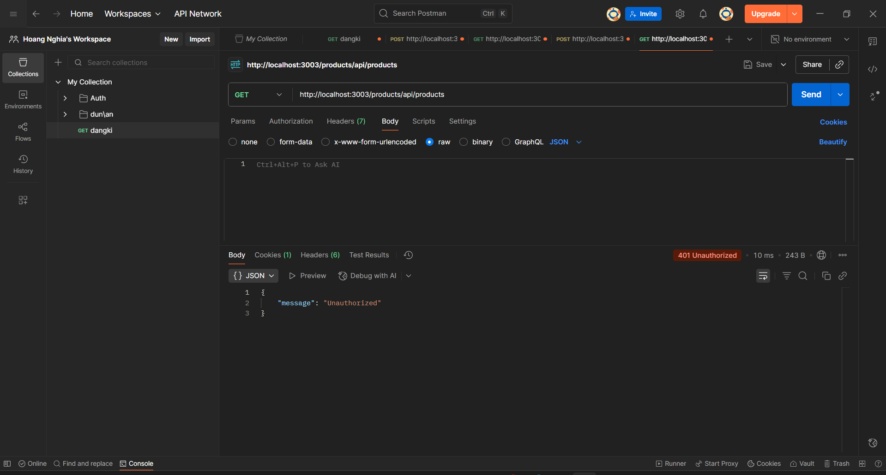
**2. Create Order with Empty IDs Array**

```http
POST /products/api/products/buy
Authorization: Bearer <VALID_JWT_TOKEN>
Content-Type: application/json

{
  "ids": []
}
```

**Expected:** `400 Bad Request` - Product IDs required


**4. Create Order with Invalid Product ID Format**

```http
POST /products/api/products/buy
Authorization: Bearer <VALID_JWT_TOKEN>
Content-Type: application/json

{
  "ids": ["invalid_id_format"]
}
```

**Expected:** `400 Bad Request` - Invalid product ID format

**5. Create Order with Non-existent Product ID**

```http
POST /products/api/products/buy
Authorization: Bearer <VALID_JWT_TOKEN>
Content-Type: application/json

{
  "ids": ["64f1a2b3c4d5e6f7g8h9i999"]
}
```

**Expected:** `400 Bad Request` - Product not found


### Using Postman

1. Import the provided Postman collection
2. Set up environment variables:
   - `base_url`: `http://localhost:3003`
   - `auth_token`: (auto-set after login)
3. **Test Execution Order:**
   - **Phase 1:** Authentication Tests (Valid + Invalid)
   - **Phase 2:** Product Tests (Valid + Invalid)
   - **Phase 3:** Order Tests (Valid + Invalid)

### Running Unit Tests

```bash
# Run all tests
npm test

# Run tests for specific service
cd auth && npm test
cd product && npm test
```

## 🔄 Message Flow

1. **User Registration/Login** → Auth Service generates JWT
2. **Product Creation** → Product Service stores in MongoDB
3. **Order Placement** → Product Service sends message to RabbitMQ
4. **Order Processing** → Order Service consumes message and saves order
5. **Order Completion** → Order Service sends confirmation back

## 🐳 Docker Support (Optional)

### Using Docker Compose

```bash
docker-compose up -d
```

This will start:

- MongoDB container
- RabbitMQ container
- All microservices

## 📁 Project Structure

```
EProject-Phase-1/
├── public/
|    └── image/
├── api-gateway/          # API Gateway service
│   ├── index.js
│   └── package.json
├── auth/                 # Authentication service
│   ├── src/
│   │   ├── controllers/
│   │   ├── models/
│   │   ├── services/
│   │   └── middlewares/
│   ├── index.js
│   └── package.json
├── product/              # Product management service
│   ├── src/
│   │   ├── controllers/
│   │   ├── models/
│   │   ├── services/
│   │   └── utils/
│   ├── index.js
│   └── package.json
├── order/                # Order processing service
│   ├── src/
│   │   ├── models/
│   │   └── utils/
│   ├── index.js
│   └── package.json
├── .gitignore
├── package.json
└── README.md
```

## 🔧 Troubleshooting

### Common Issues

1. **Port already in use**

   ```bash
   # Find process using port
   netstat -ano | findstr :3000
   # Kill process
   taskkill /F /PID <PID>
   ```

2. **MongoDB connection failed**

   - Ensure MongoDB is running
   - Check connection string in .env files

3. **RabbitMQ connection failed**

   - Ensure RabbitMQ server is running
   - Check if port 5672 is accessible

4. **JWT token issues**
   - Ensure JWT_SECRET is set in all .env files
   - Check token expiration

## 🤝 Contributing

1. Fork the repository
2. Create a feature branch (`git checkout -b feature/AmazingFeature`)
3. Commit your changes (`git commit -m 'Add some AmazingFeature'`)
4. Push to the branch (`git push origin feature/AmazingFeature`)
5. Open a Pull Request

## 📄 License

This project is licensed under the ISC License - see the [LICENSE](LICENSE) file for details.

## 👥 Authors

- **Your Name** - Initial work

## 🙏 Acknowledgments

- Node.js community
- Express.js team
- MongoDB team
- RabbitMQ team
